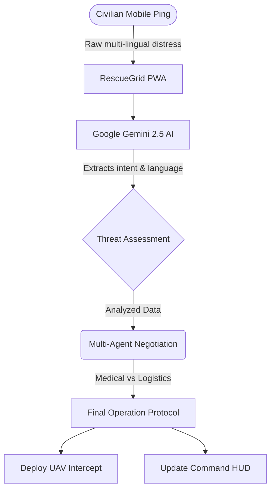
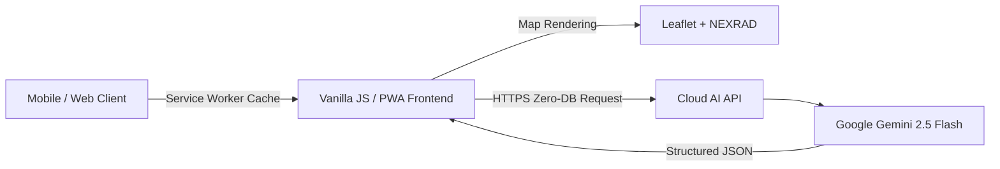

# Solution Challenge 2026 - PPT Content Draft: RescueGrid A.I.D.A.
*Use this document to directly copy and paste content into your required `.pptx` template slides.*

---

## Slide 2: Team Details
- **Team name:** [Insert your Team Name]
- **Team leader name:** [Insert Leader Name]
- **Problem Statement:** 
  During catastrophic infrastructure failures, traditional emergency dispatch systems collapse. There is a critical gap in quickly turning unstructured, multi-lingual human panic into structured, actionable tactical data for first responders.

---

## Slide 3: Brief about your solution
**RescueGrid A.I.D.A.** is a "Zero-Infrastructure" tactical web dashboard built for immediate deployment. Relying strictly on edge-computing (PWA) and the Google Gemini Neural Network, the platform bypasses the need for vulnerable backend databases. 

It instantly ingests chaotic, multi-lingual distress data from civilians and synthesizes it into live map deployments, automated civilian swarm tracking, and simulated UAV drone dispatch protocols. It trades network latency for edge intelligence.

---

## Slide 4: Opportunities
- **How different is it from existing ideas?**
  Instead of relying on fragile cloud databases that go down during power grid failures, RescueGrid operates 100% serverlessly via edge-computing (PWA), maintaining core interface functionality entirely in-browser.
- **How will it solve the problem?**
  By integrating **Google Gemini 2.5 Flash**, the system directly processes native language and raw panic, mathematically normalizing the incoming data to calculate squad manpower constraints and outputting immediate survival protocols.
- **USP (Unique Selling Proposition):** 
  "Zero-Infrastructure" requirements, holographic HUD compatibility for hands-free terminal use, and an autonomous multi-agent AI architecture (`MEDICAL` vs `LOGISTICS`) that pre-negotiates resource distribution.

---

## Slide 5: Features offered by the solution
1. **Native Multi-Lingual Generative AI Triaging:** Translates regional languages directly into standardized threat assessments.
2. **Civilian UAV & Thermal Tracking:** Simulates physical dispatch of drones with a FLIR thermal uplink view.
3. **Holographic HUD Presentation Mode:** Inverts the matrix layer to project a 3D "Pepper’s Ghost" illusion mimicking military hardware.
4. **Agentic Logistics Workflow:** Live backend negotiation between independent sub-agents resolving resource conflicts.
5. **Tactical Quarantine Geofencing:** Drawing exclusion zones directly on the map to halt civilian swarm pathing.

---

## Slide 6: Process flow diagram or Use-case diagram
*(You can use this Mermaid diagram or build a visual flowchart based on it)*

---

## Slide 7: Wireframes/Mock diagrams
*(Insert earlier stage mockups or concepts of the HUD / Drone modes from before you coded them, if applicable. If not, include a placeholder stating "UI designed straight in code focusing on Glassmorphism / Cyberpunk HUD constraints".)*

---

## Slide 8: Architecture diagram of the proposed solution
*(You can use this architecture flow)*

*Note: Include text next to it mentioning that the solution is highly decentralized, skipping a complex SQL backend layer to ensure up-time during crises.*

---

## Slide 9: Technologies to be used in the solution
- **AI Engine:** Google Generative AI (`gemini-2.5-flash`)
- **Frontend Architecture:** Progressive Web App (PWA) with Vanilla HTML5, CSS3, JavaScript.
- **Mapping:** Leaflet.js Mapping Engine + High-fidelity Hybrid & Radar Tiles.
- **Cloud Deployment:** GitHub Pages / Firebase Hosting (ensuring high-availability static delivery to meet the solution challenge requirements).

---

## Slide 10: Estimated implementation cost 
- **Database/Compute:** $0 (Client-side edge processing utilizing PWA architecture).
- **Hosting:** $0 (Free tiers of static CDNs like Firebase or GitHub Pages).
- **AI Processing:** Minimal - Fractions of a cent per request using Gemini 2.5 Flash, exceptionally cost-effective at scale compared to slower, heavier LLMs.
- **Overall:** Functionally free to deploy and scale aggressively during emergent local crises.

---

## Slide 11: Snapshots of the MVP
*(Copy over high-quality screenshots of:)*
1. The Main Dashboard with map and dispatch logs.
2. The HUD Projection Mode (inverted colors).
3. The Flir Thermal Drone stream feature.

---

## Slide 12: Additional Details/Future Development 
- **Mesh Networking:** Implementing WebRTC/Bluetooth mesh networks to share local PWA states when cell towers are entirely offline.
- **Hardware Integration:** Translating simulated Drone dispatches into actual proprietary drone API payloads (e.g., DJI mobile SDKs).
- **Advanced Multimodal:** Allowing users to upload images of injuries, having Gemini Flash natively analyze triage severity via vision.

---

## Slide 13: Links
- **GitHub Public Repository:** *(Insert your Github URL)*
- **Demo Video Link:** *(Insert YouTube link)*
- **MVP / Prototype Link:** *(Insert your Firebase/Vercel/GitHub Pages live link)*
